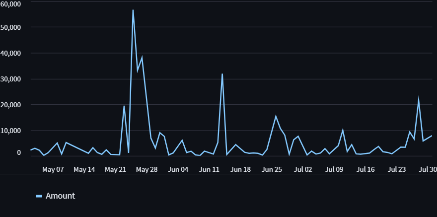

# User Behavior

## How to run the project


```bash
Project structure:

├── README.md
├── app
│   ├── __init__.py
│   ├── main.py
│   ├── routers
│   └── test_main.py
├── behavior
│   ├── config.py
│   └── main.py
├── data
│   ├── images
│   └── statement.csv
├── docker
│   └── Dockerfile
├── docker-compose.yaml
├── logging.conf
├── requirements.txt
└── venv
└── .env
```

###  [1] create a virtual environment
```bash
python3 -m venv venv
```

### [2] create global environment variable

```bash
touch .env
```
this file contains variables to be used in the project

```TEXT
DAILY_EXPENSES=daily_expenses
WEEKLY_EXPENSES=weekly_expenses
MONTHLY_EXPENSES=monthly_expenses
CATEGORY_EXPENSES=category_expenses
PREDICTIVE_EXPENSES=predictive_model
USER_BEHAVIOR_URL=http://127.0.0.1:8000
```

### [3] Docker container to run the project

docker-compose.yaml

```docker-compose
version: '3'

services:
  user-behavior:
    build:
      context: .
      dockerfile: docker/Dockerfile
    ports:
      - "8000:5001"
    volumes:
      - ./data:/app/data  # Adjust the paths as necessary
    networks:
      - stackcards

networks:
  stackcards:
    driver: bridge
```

Docker/Dockerfile

```docker
FROM python:3.9.0-slim

WORKDIR /UserBehavior

# Copy application code and data
COPY app app
COPY data data
COPY requirements.txt logging.conf ./

# Upgrade pip and install Python dependencies
RUN pip install --upgrade pip && \
    pip install -r requirements.txt

# Install system dependencies
RUN apt-get update && \
    apt-get -y install postgresql && \
    apt-get clean

EXPOSE 5001

# Start Gunicorn server with Uvicorn worker
CMD ["gunicorn", "app.main:router", "-k", "uvicorn.workers.UvicornWorker", "--bind", "0.0.0.0:5001"]
```

### [4] How to run the project locally

Run the project using docker

```bash
docker-compose up --build
```

### [5] View analytics results/visualisations

First run the project to run computational endpoints.
open a terminal window and run this code

```bash
$ source venv\bin\active # linux/unix
$ venv/scripts/activate # windows
$ cd project/
$ uvicorn app.main:router --host 'localhost' --port 8000 
```
check to see if the endpoints respond

```bash
curl -X 'http://localhost:8000/' -H 'accept: json/application'
```

response:

```json
{
    "User bahavior": "Analysis"
}
```

```bash
curl -X 'http://localhost:8000/daily_expenses' -H 'accept: json/application'
```

response:

```json
{
    "2023/05/02": 2222,
    "2023/05/03": 2914.35,
    "2023/05/04": 2154.95,
    "2023/05/05": 164,
    "2023/05/06": 1255.84,
    "2023/05/08": 4964.34,
    "2023/05/09": 710,
    "2023/05/10": 5155.73,
    ...
}
```

open another terminal

```bash
$ source venv/bin/activate # linux
$ venv\scripts\activate # windows
$ pip install -r requirements.txt
$ cd app
$ streamlit run behavior/main.py
```

Open a browser to check if the response is as visualised

http://localhost:8501/




# Code documentation

```bash
    app/
        main.py
```
This module serves as the entry point for routing in the application. It defines a root endpoint and incorporates additional routing configurations from analytics_router.

```python
from fastapi import APIRouter, Path, Query
from typing import Optional

from .routers.analytics import analytics_router

router = APIRouter()

@router.get('/', tags=['Welcome page'])
async def index():
    """Welcome page"""
    return {
        "User bahavior": "Analysis"
    }

# include routers
router.include_router(analytics_router)
```

Under 
```bash
app
   |__routers/
        |___analytics.py
```

expand on the incomplete endpoints:

- weekly_expenses
- monthly_expenses
- category_expenses
- predictive_model [optional]

```python
@analytics_router.get('/data')
async def read_statement():
    """Read CSV file statement and return data as dataframe"""
    df = process_statement() # read a csv file and get dataframe
    res = df.to_json(orient="records")
    parsed = json.loads(res)

    return parsed


@analytics_router.get('/daily_expenses')
async def daily_expenses():
    """Return daily expenses tabulated data"""
    res = await read_statement()
    total_expenses = total_daily_expenses(res)
    
    return total_expenses


@analytics_router.get('/weekly_expenses')
async def weekly_expenses():
    """Return weekly expenses tabulated data"""
    pass


@analytics_router.get('/monthly_expenses')
async def monthly_expenses():
    """Return monthly expenses tabulated data"""
    pass


@analytics_router.get('/category_expenses')
async def expenses_per_category():
    """Return expenses per category, monthly"""
    pass


# machine learning model - optional
#X, y = get_features_and_target()
#X_train, X_test, y_train, y_test = train_test_split(X, y, test_size=0.2, random_state=0)

#model = LinearRegression()
#model.fit(X_train, y_train)

@analytics_router.post('/predictive_model')
async def predictive_behavior(features: list):
    """
    Receive a list of features, make a prediction using a trained model, 
    and return the prediction.
    """
    try:
        features_array = np.array(features).reshape(1, -1)
        prediction = model.predict(features_array)
        return {"prediction": prediction.tolist()}
    except Exception as e:
        raise HTTPException(status_code=400, detail=str(e))
```

Data is processed under data_loader.py module for the predictive model using joblib [Optional]


# Guideline
Given a user's expenses statement under data/statement.csv create a program that will analyse the user's behavior. 

```TEXT
CATEGORIES
PLACES
PAYMENT
DEBITS
```

Example

Top Categories          |    % of total spend
------------------------|----------------------
Uncategorised           |
-R9 405.24              |          66.23
Insurance               |
-R3 351.00              |          23.
Transfers               |              
-R1 000.00              |           7.04
Bank Charges & Fees     |
-R445.50                |           3.14

Data analysis from the statement should be reported back to the user

Example


Needs                      |             | Wants                |             | Uncategorised  |                |
---------------------------|-------------|----------------------|-------------|----------------|----------------|
Description                | Amount (R)  | Description          | Amount (R)  | Description    |  Amount (R)    |
Insurance                  | 3 351       | Donations            |   0         | Kagiso         |  1 000         |
Loans and account          | 1 920.00    | Entertainment        |   0         | Mamikie        |  400           |
Transfers                  | 1 000.00    | Family and Friends   |   0         |
Fees and Interests         | 445.00      | Food and Drink       |   0         |
Clothing and Accessories   | 0           | Holiday and Travel   |   0         |
Education                  | 0           | Home                 |   0         |
Family and   Friends       | 0           | Medical and wellness |             |
Groceries                  | 0           |                      |             |
Home                       | 0           |                      |             |
Medical and Wellness       | 0           |                      |             |
Pets                       | 0           |                      |             |
Salaries &   wages Paid    | 0           |                      |             |
Tax                        | 0           |                      |             |
Vehicle and Transportation | 0           |                      |             |


[1] Compute total money in
[2] Compute total money out
[3] Compute variance
[4] Compute total number of transactions


# Unittesting

Under app/router
```bash
    app/
    |___routers/
        |___analytics.py
```

How you can write unittests against your code

```python
from pytest import mark

@mark.parametrize('input_data, output_data', [(i, f"{str(i)[:4]}/{str(i)[4:6]}/{str(i)[6:]}") for i in [20230511 + j for j in range(10)]])
def test_transform_date(input_data, output_data):
    assert transform_date(input_data) == output_data

def transform_date(input_date):
    # Convert the input to string in case it's an integer
    date_str = str(input_date)
    
    # Convert string to datetime object
    date_obj = datetime.strptime(date_str, '%Y%m%d')
    
    # Format datetime object to desired format
    formatted_date = date_obj.strftime('%Y/%m/%d')
    return formatted_date
```

in your command line

```bash
pytest -v app/routers/analytics.py
```

```bash
=================================================================================== 10 passed in 0.91s ====================================================================================
(venv)> pytest -v app/routers/analytics.py
=================================================================================== test session starts ===================================================================================
platform win32 -- Python 3.7.9, pytest-7.4.2, pluggy-1.2.0 -- e:\business\stackcards\user behavior\venv\scripts\python.exe
cachedir: .pytest_cache
rootdir: E:\Business\StackCards\user behavior
plugins: anyio-3.7.1
collected 10 items

app/routers/analytics.py::test_transform_date[20230511-2023/05/11] PASSED                                                                                                            [ 10%]
app/routers/analytics.py::test_transform_date[20230512-2023/05/12] PASSED                                                                                                            [ 20%]
app/routers/analytics.py::test_transform_date[20230513-2023/05/13] PASSED                                                                                                            [ 30%]
app/routers/analytics.py::test_transform_date[20230514-2023/05/14] PASSED                                                                                                            [ 40%]
app/routers/analytics.py::test_transform_date[20230515-2023/05/15] PASSED                                                                                                            [ 50%]
app/routers/analytics.py::test_transform_date[20230516-2023/05/16] PASSED                                                                                                            [ 60%]
app/routers/analytics.py::test_transform_date[20230517-2023/05/17] PASSED                                                                                                            [ 70%]
app/routers/analytics.py::test_transform_date[20230518-2023/05/18] PASSED                                                                                                            [ 80%]
app/routers/analytics.py::test_transform_date[20230519-2023/05/19] PASSED                                                                                                            [ 90%]
app/routers/analytics.py::test_transform_date[20230520-2023/05/20] PASSED                                                                                                            [100%]

=================================================================================== 10 passed in 0.75s ====================================================================================
```

## References

[1] https://streamlit.io/
[2] https://plotly.com/python/plotly-express/
[3] https://pytorch.org/
[4] https://vaex.io/docs/index.html


# How to submit your code

[1] Clone the project
[2] submit a zip file

